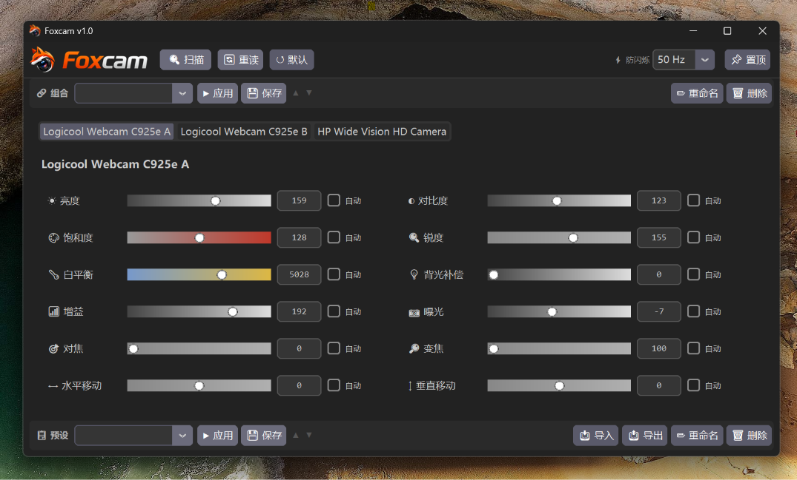

# Foxcam

> **官网 Website:** [https://hzdavy.github.io/Foxcam/](https://hzdavy.github.io/Foxcam/)

[](https://github.com/HZDavy/Foxcam/releases)
[](https://github.com/HZDavy/Foxcam/blob/main/LICENSE)
[](https://www.python.org/)
[](https://www.microsoft.com/windows/)

<p align="center">
  
</p>

---

Foxcam 是一款轻量 Windows 桌面应用，用于实时控制 UVC（USB Video Class）摄像头参数。
Foxcam is a lightweight Windows desktop application for real-time control of UVC (USB Video Class) camera parameters.

<p align="center">
  
</p>

## 功能特性 / Features

多摄像头支持 — 同时检测和控制多个 USB 摄像头
Multi-camera support — Detect and control multiple USB cameras simultaneously

实时参数调节 — 亮度、对比度、饱和度、色调、伽马、白平衡、曝光、缩放、对焦等
Real-time parameter adjustment — Brightness, contrast, saturation, hue, gamma, white balance, exposure, zoom, focus, and more

自动/手动切换 — 每个参数可在自动和手动模式间切换
Auto/Manual toggle — Switch between automatic and manual mode for each parameter

预设 — 按摄像头保存和加载参数配置
Presets — Save and load parameter configurations per camera

组合预设 — 跨多个摄像头一键应用预设组合
Combos — Apply preset combinations across multiple cameras at once

标签拖拽排序 — 拖拽重新排列摄像头标签，顺序会被记住
Tab drag-and-drop — Reorder camera tabs by dragging, order is remembered

导入/导出 — 在不同电脑之间分享预设
Import/Export — Share presets between machines

深色主题 — 基于 CustomTkinter 的简洁现代深色 UI
Dark theme — Clean, modern dark UI built with CustomTkinter

## 快速开始 / Quick Start

### 下载（无需 Python）/ Download (No Python required)

从 Releases 下载最新版。提供两个语言版本：
Download the latest release from [Releases](https://github.com/HZDavy/Foxcam/releases). Two language versions are available:

- [Foxcam-v1.1.zip](https://github.com/HZDavy/Foxcam/releases/download/v1.1/Foxcam-v1.1.zip) — 中文版 / Chinese version
- [Foxcam-EN-v1.1.zip](https://github.com/HZDavy/Foxcam/releases/download/v1.1/Foxcam-EN-v1.1.zip) — 英文版 / English version

解压后运行 `Foxcam.exe`。
Extract the zip and run `Foxcam.exe`.

### 从源码运行 / Run from Source

```bash
git clone https://github.com/HZDavy/Foxcam.git
cd Foxcam
pip install -r requirements.txt
python app.py
```

### 打包 EXE / Build EXE

```bash
pip install pyinstaller
pyinstaller --onedir --windowed --name Foxcam --icon foxcam.ico --add-data "icon.png;." --add-data "foxcam_logo.png;." --add-data "foxcam.ico;." --hidden-import duvc_ctl --hidden-import dshow --hidden-import customtkinter --hidden-import PIL app.py
```

## 语言 / Languages

当前支持：中文 和 English（英文）
Currently supported: Chinese and English

## 系统要求 / Requirements

Windows 10/11
Windows 10/11

Python 3.10+（从源码运行时需要）
Python 3.10+ (required for running from source)

支持 UVC DirectShow 属性的 USB 摄像头
USB camera(s) that support UVC DirectShow properties

## 依赖 / Dependencies

[duvc-ctl](https://github.com/allanhanan/duvc-ctl) — DirectShow Video Processing Amp 控制的 Python 封装，用于读取和设置摄像头属性
[duvc-ctl](https://github.com/allanhanan/duvc-ctl) — Python wrapper for DirectShow Video Processing Amp control, used to read and set camera properties

[CustomTkinter](https://github.com/TomSchimansky/CustomTkinter) — 现代化外观的 tkinter 组件库
[CustomTkinter](https://github.com/TomSchimansky/CustomTkinter) — Modern-looking tkinter widgets library

[Pillow](https://python-pillow.org/) — UI 资源图像处理
[Pillow](https://python-pillow.org/) — Image processing for UI assets

## 相关项目 / Related Projects

[duvc-ctl](https://github.com/allanhanan/duvc-ctl) — 本项目依赖的 DirectShow 摄像头控制核心库
[duvc-ctl](https://github.com/allanhanan/duvc-ctl) — The core library this project depends on for DirectShow camera control

[camrenamer](https://github.com/oe7set/camrenamer/) — 在 Windows 中重命名 USB 摄像头的工具，当你有多个同型号摄像头需要区分时很有用
[camrenamer](https://github.com/oe7set/camrenamer/) — A tool to rename USB cameras in Windows, useful when you have multiple cameras of the same model and need to tell them apart

## 许可证 / License

本项目基于 MIT 许可证开源。详见 LICENSE。
This project is licensed under the MIT License. See [LICENSE](LICENSE) for details.
